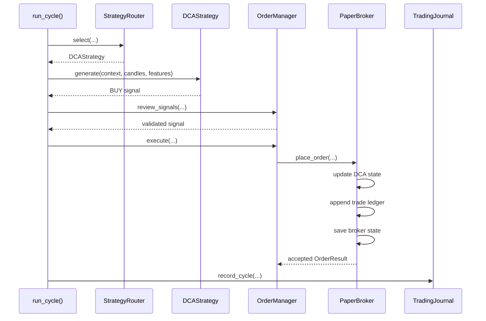
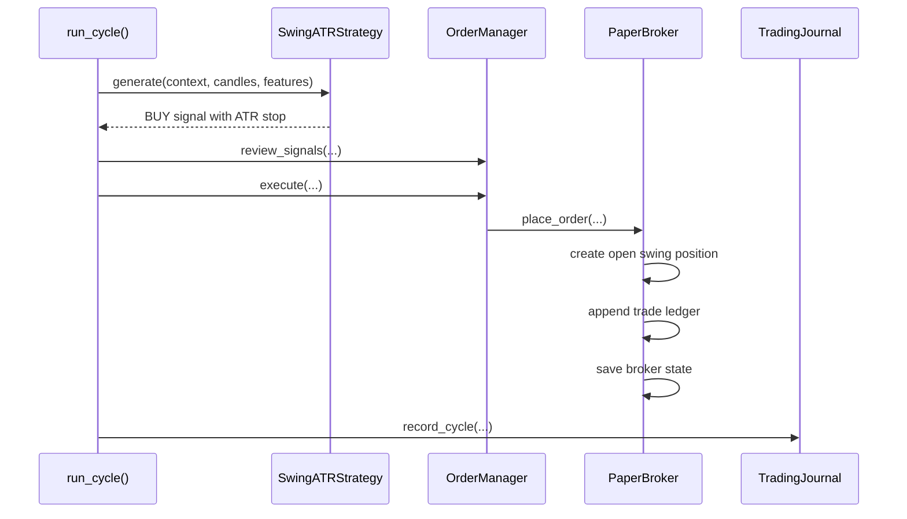
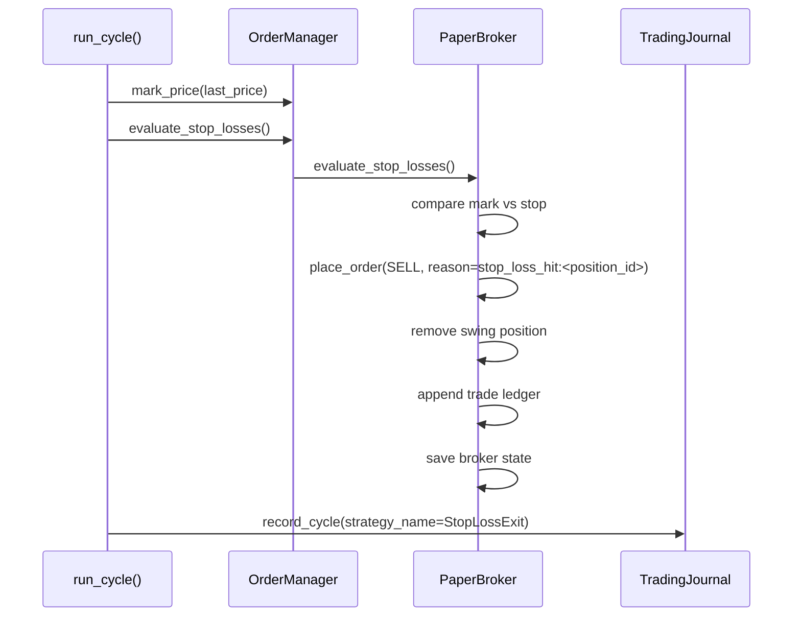
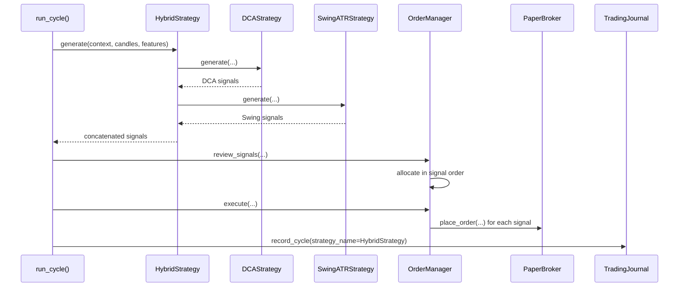

# Strategy Specification

This document is the authoritative strategy definition for the current project.

Ownership boundary:
- active strategy behavior
- formulas
- trade lifecycle rules
- execution semantics relevant to strategies

This document does not define:
- storage layout in detail
- metrics catalog
- future roadmap beyond explicit notes

## 1. Scope

**Status: CURRENT IMPLEMENTATION**

This specification covers the active strategy surface:
- `DCAStrategy`
- `SwingATRStrategy`
- `HybridStrategy`

It also documents shared strategy-adjacent behavior:
- strategy routing
- drawdown guard
- post-strategy LLM review boundary
- capital allocation order
- persistence semantics relevant to strategy outputs

## 2. Shared Runtime Strategy Path

**Status: CURRENT IMPLEMENTATION**

Current live paper-trading order of operations:

```text
Load candles
-> compute indicators
-> compute regime score
-> update broker mark price
-> evaluate swing stop-losses
-> build AgentContext
-> select strategy
-> generate deterministic signals
-> apply drawdown guard
-> optionally apply LLM review
-> allocate capital sequentially
-> execute paper orders
-> persist broker state and fills
-> persist cycle journal and snapshot
```

Primary code path:
- [app/main.py](../app/main.py)
- [app/execution/order_manager.py](../app/execution/order_manager.py)
- [app/execution/paper_broker.py](../app/execution/paper_broker.py)

### Shared Definitions

Decision Owner Strategy:
- the cycle-selected strategy persisted in journal artifacts
- examples:
  - `DCAStrategy`
  - `SwingATRStrategy`
  - `HybridStrategy`
  - `StopLossExit`

Execution Strategy:
- the `strategy_name` attached to executed fills
- examples:
  - `DCAStrategy`
  - `SwingATRStrategy`

Portfolio Guard:

```text
trading_paused if drawdown_percent >= max_drawdown_percent
```

Capital Allocation:

```text
allocated_size_usd = min(signal.size_usd, remaining_cash)
remaining_cash -= allocated_size_usd
```

Source:
- [app/strategies/portfolio_guard.py](../app/strategies/portfolio_guard.py)
- [app/strategies/capital_allocator.py](../app/strategies/capital_allocator.py)

## 3. DCAStrategy

### 3.1 Definition

**Status: CURRENT IMPLEMENTATION**

`DCAStrategy` is the base accumulation layer.

It is defined as:
- initial BTC entry when no DCA anchor exists
- additional buys only when price falls below a configured anchor threshold
- no DCA stop-loss
- no DCA take-profit
- regime-aware rebalance sells in weaker regimes

Primary file:
- [app/strategies/dca.py](../app/strategies/dca.py)

### 3.2 Entry Rules

**Status: CURRENT IMPLEMENTATION**

#### DCA Entry Preconditions

No signal if:

```text
last_price <= 0
```

#### Initial DCA Entry

If no prior DCA buy anchor exists:

```text
if latest_dca_buy_price is None:
    BUY reason="initial_dca_entry"
```

#### Price-Drop DCA Entry

Drop threshold:

```text
drop_threshold = latest_dca_buy_price * (1 - dca_drop_percent / 100)
```

Entry condition:

```text
if last_price <= drop_threshold:
    BUY reason="price_drop_dca_entry"
```

#### Bearish Entry Gate

New DCA buys are blocked when:

```text
regime == BEARISH
and dca_enabled_in_bearish == False
```

### 3.3 DCA Rebalance Sell

**Status: CURRENT IMPLEMENTATION**

This is an official part of DCA behavior.

Rebalance is evaluated before new DCA entry logic.

Target allocation:

```text
WEAKENING_BULL -> weakening_bull_target_allocation_percent
BEARISH -> bearish_target_allocation_percent
```

Current BTC allocation:

```text
btc_value_usd = snapshot.btc_units * mark_price
total_equity_usd = snapshot.cash_usd + btc_value_usd
btc_allocation_percent = (btc_value_usd / total_equity_usd) * 100
```

Trigger:

```text
if current_allocation_percent > target_allocation_percent + rebalance_tolerance_percent:
    emit SELL
```

Sell size:

```text
target_btc_value_usd = total_equity_usd * (target_allocation_percent / 100)
excess_btc_value_usd = current_btc_value_usd - target_btc_value_usd
max_cycle_sell_usd = snapshot.dca_btc_units * mark_price * rebalance_max_sell_fraction
sell_size_usd = min(excess_btc_value_usd, max_cycle_sell_usd)
```

Signal:

```text
SELL reason="dca_rebalance_sell:<regime>"
```

### 3.4 Sizing and Allocation

**Status: CURRENT IMPLEMENTATION**

Requested size:

```text
requested_size_usd = dca_order_size_usd
```

Weakening-bull scaling:

```text
requested_size_usd *= dca_weakening_bull_size_multiplier
```

Remaining BTC capacity:

```text
max_btc_value_usd = total_equity_usd * (max_btc_allocation_percent / 100)
remaining_capacity_usd = max(0, max_btc_value_usd - btc_value_usd)
```

Final size:

```text
target_order_size_usd = min(
    requested_size_usd,
    available_cash_usd,
    remaining_capacity_usd,
)
```

Minimum size:

```text
MIN_ORDER_SIZE_USD = 1.0
```

### 3.5 Stop Loss and Take Profit

**Status: CURRENT IMPLEMENTATION**

DCA has:
- no stop-loss
- no take-profit

### 3.6 Persistence Semantics

**Status: CURRENT IMPLEMENTATION**

On DCA buy:
- broker updates `dca_btc_units`
- recalculates `dca_avg_entry_price`
- updates `latest_dca_buy_price`

On DCA sell:
- broker reduces `dca_btc_units`
- updates realized PnL

Persistence files:
- `paper_broker_state.json`
- `paper_trade_ledger.jsonl`
- cycle journal artifacts

### 3.7 Example

**Status: CURRENT IMPLEMENTATION**

Inputs:
- `latest_dca_buy_price = 74,000`
- `dca_drop_percent = 1.5`
- `last_price = 72,850`

Formula:

```text
drop_threshold = 74,000 * (1 - 0.015) = 72,890
```

Result:

```text
72,850 <= 72,890 -> BUY
```

## 4. SwingATRStrategy

### 4.1 Definition

**Status: CURRENT IMPLEMENTATION**

`SwingATRStrategy` is the opportunistic long swing layer.

It is defined as:
- momentum-based long entries
- fixed-size entry capped by cash
- ATR-derived stop-loss level at entry
- exits through:
  - take profit
  - trend exit
  - no-follow-through exit
  - broker-driven ATR stop-loss execution

Primary file:
- [app/strategies/swing_atr.py](../app/strategies/swing_atr.py)

### 4.2 Swing ATR Entry

**Status: CURRENT IMPLEMENTATION**

No signal if:

```text
last_price <= 0 or atr <= 0
```

Entry only evaluated when:
- no active swing positions exist
- regime gate allows new swing entries

Entry regime gate:

```text
None or BULLISH -> allowed
WEAKENING_BULL -> swing_enabled_in_weakening_bull
SIDEWAYS -> swing_enabled_in_sideways
BEARISH -> swing_enabled_in_bearish
```

Entry conditions:

```text
rsi < swing_entry_rsi_max
and macd_histogram > 0
and ema_fast > ema_slow
```

Entry size:

```text
size_usd = min(250.0, available_cash_usd)
```

Entry signal:

```text
BUY reason="momentum_atr_setup"
```

### 4.3 ATR Stop-Loss

**Status: CURRENT IMPLEMENTATION**

Stop-loss level is defined by the strategy:

```text
stop_loss = last_price - (atr_multiplier * atr)
```

But stop-loss execution is broker-driven before normal strategy generation:

```text
if last_mark_price <= stop_loss:
    SELL reason="stop_loss_hit:<position_id>"
```

This is an important part of the official definition:
- strategy defines the stop level
- broker executes the stop exit

### 4.4 Take Profit

**Status: CURRENT IMPLEMENTATION**

Target:

```text
take_profit_price = entry_price * (1 + swing_take_profit_percent / 100)
```

Trigger:

```text
if last_price >= take_profit_price:
    SELL reason="swing_take_profit:<position_id>"
```

### 4.5 Trend Exit

**Status: CURRENT IMPLEMENTATION**

Trigger:

```text
if macd_histogram <= 0
or ema_fast <= ema_slow:
    SELL reason="swing_signal_exit:<position_id>"
```

### 4.6 No-Follow-Through Exit

**Status: CURRENT IMPLEMENTATION**

Follow-through target:

```text
follow_through_target = entry_price * (1 + swing_follow_through_buffer_percent / 100)
```

Elapsed-candle count:

```text
candles_since_entry = count(candle.timestamp >= opened_at)
```

Trigger:

```text
if candles_since_entry >= swing_no_follow_through_candles
and last_price < follow_through_target:
    SELL reason="swing_no_follow_through:<position_id>"
```

### 4.7 Open Position Rule

**Status: CURRENT IMPLEMENTATION**

If one or more active swing positions exist:
- exit management runs
- no new swing entry is evaluated in that cycle

### 4.8 Sizing and Allocation

**Status: CURRENT IMPLEMENTATION**

Entry size:

```text
size_usd = min(250.0, available_cash_usd)
```

Exit size:

```text
size_usd = btc_units * last_price
```

There is no explicit internal BTC allocation cap in `SwingATRStrategy`.

### 4.9 Persistence Semantics

**Status: CURRENT IMPLEMENTATION**

On non-DCA buy, broker stores:
- `position_id`
- `entry_price`
- `stop_loss`
- `btc_units`
- `size_usd`
- `opened_at`
- `origin_strategy`
- `strategy_name`

On sell, broker removes the matching swing position by position id parsed from reason.

### 4.10 Example

**Status: CURRENT IMPLEMENTATION**

Inputs:
- `last_price = 73,600`
- `atr = 45`
- `atr_multiplier = 2`

Stop-loss:

```text
stop_loss = 73,600 - (2 * 45) = 73,510
```

If:
- `rsi < threshold`
- `macd_histogram > 0`
- `ema_fast > ema_slow`

then:
- BUY
- reason=`momentum_atr_setup`

## 5. HybridStrategy

### 5.1 Definition

**Status: CURRENT IMPLEMENTATION**

`HybridStrategy` is a composition strategy, not a separate rule engine.

It is defined as:
- DCA generate
- SwingATR generate
- concatenate both outputs
- preserve DCA-first ordering

Primary file:
- [app/strategies/hybrid.py](../app/strategies/hybrid.py)

### 5.2 Hybrid Composition Logic

**Status: CURRENT IMPLEMENTATION**

Actual implementation:

```text
dca_outcome = DCAStrategy.generate(...)
swing_outcome = SwingATRStrategy.generate(...)
signals = dca_outcome.signals + swing_outcome.signals
```

Trace is similarly concatenated:

```text
component:DCAStrategy
...
component:SwingATRStrategy
...
```

### 5.3 Allocation Consequence

**Status: CURRENT IMPLEMENTATION**

Because the allocator is sequential, DCA gets first claim on cash in hybrid mode.

Example:

```text
DCA signal = 100
Swing signal = 250
Available cash = 300

DCA gets 100
remaining_cash = 200
Swing gets 200
```

### 5.4 Decision Owner vs Execution Strategy

**Status: CURRENT IMPLEMENTATION**

In hybrid mode:
- journal cycle strategy may be `HybridStrategy`
- executed fills may still be `DCAStrategy` or `SwingATRStrategy`

This is official current behavior.

## 6. Strategy Routing

**Status: CURRENT IMPLEMENTATION**

Primary router:
- [app/strategies/router.py](../app/strategies/router.py)

Explicit profile routing:
- `dca_only` -> `DCAStrategy`
- `swing_only` -> `SwingATRStrategy`
- `hybrid_current` -> `HybridStrategy`

If explicit profile does not decide the cycle, router uses:
- regime label
- bullish trend flag
- open swing position state
- regime score
- regime confidence
- deterioration score

## 7. LLM Boundary

**Status: CURRENT IMPLEMENTATION**

Strategies do not call the LLM directly.

Current flow:

```text
Strategy.generate(...)
-> OrderManager.review_signals(...)
-> optional LLM review
-> validate_advice(...)
-> allocate(...)
-> execute(...)
```

This means:
- strategy generation remains deterministic
- post-strategy execution may still be modified by bounded review

## 8. Documentation Corrections

### 8.1 DCA

**Status: CURRENT IMPLEMENTATION**

Official correction:
- DCA is not schedule-driven
- DCA is anchor-price-driven

Official correction:
- DCA is not buy-only
- it includes rebalance sells

### 8.2 Swing ATR

**Status: CURRENT IMPLEMENTATION**

Official correction:
- ATR affects stop-loss distance
- ATR does not affect position sizing

### 8.3 Hybrid

**Status: CURRENT IMPLEMENTATION**

Official correction:
- Hybrid is a composition layer
- not an integrated independent signal engine

## 9. Experimental Surface

### Pullback / Structure Logic

**Status: EXPERIMENTAL**

The repo still contains older pullback and structure-oriented logic, but it is not part of the active official strategy baseline documented here.

## 10. Sequence Diagrams

### 10.1 DCA Buy

**Status: CURRENT IMPLEMENTATION**



### 10.2 Swing Buy

**Status: CURRENT IMPLEMENTATION**



### 10.3 Swing Stop-Loss

**Status: CURRENT IMPLEMENTATION**



### 10.4 Hybrid Cycle

**Status: CURRENT IMPLEMENTATION**


